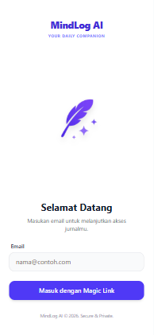
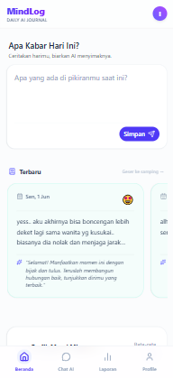

# 🧠 MindLog AI

> **Your Daily AI Companion.** Jurnal harian cerdas yang memahami perasaanmu, menganalisis mood, dan memberikan insight berharga menggunakan Google Gemini AI.


---

## ✨ Fitur Utama

- **📱 Mobile First Experience** — Seluruh layout dan komponen di-redesign sepenuhnya dengan pendekatan *mobile-first*, menghadirkan tampilan UI/UX yang modern, *clean*, dan lebih mudah dinavigasikan melalui navigasi bawah (*Bottom Navigation*).
- **🧭 Ekosistem Dasbor Lengkap** — Telah terintegrasi dengan struktur multi-halaman untuk pengalaman jurnal yang lebih komprehensif:
  - **Dashboard**: Tampilan utama untuk *journaling* cepat dan performa emosional harian.
  - **Chat AI**: Ruang interaktif eksklusif untuk ngobrol dengan AI secara personal.
  - **Report**: Laporan mendalam terkait perubahan *mood* dan statistik mingguan.
  - **Profile**: Halaman manajemen data profil.
- **📝 Smart Journaling** — Tulis ceritamu hari ini dengan antarmuka yang bersih dan bebas distraksi.
- **🤖 AI Mood Analysis** — Google Gemini AI membaca jurnalmu, memberikan skor mood (1-10), label emosi, dan saran singkat yang berempati.
- **📊 Weekly Mood Chart** — Visualisasi grafik perubahan emosi mingguanmu, lengkap dengan rata-rata skor.
- **🔐 Secure & Private** — Data tersimpan aman menggunakan Supabase Auth (Magic Link) & PostgreSQL dengan Row Level Security. Sistem *session handling* diproteksi dan diarahkan otomatis (*route-based redirect*) oleh *middleware*.
- **⚡ Modern Tech Stack** — Dibangun dengan Next.js 15 (App Router), Server Actions, dan Turbopack untuk performa maksimal.

---

## 🛠️ Tech Stack

| Layer | Teknologi |
|-------|-----------|
| **Framework** | [Next.js 15](https://nextjs.org/) (App Router + Turbopack) |
| **Language** | TypeScript 5 |
| **Database & Auth** | [Supabase](https://supabase.com/) (PostgreSQL + Magic Link Auth) |
| **ORM** | [Drizzle ORM](https://orm.drizzle.team/) |
| **AI Model** | [Google Gemini 2.5 Flash](https://ai.google.dev/) |
| **Styling** | [Tailwind CSS 4](https://tailwindcss.com/) + [shadcn/ui](https://ui.shadcn.com/) |
| **Charts** | [Recharts](https://recharts.org/) |
| **Validation** | [Zod](https://zod.dev/) |
| **Deployment** | [Vercel](https://vercel.com/) |

---

## 📁 Struktur Proyek Terkini

```text
mindlog-ai/
├── src/
│   ├── actions/              # Server Actions (AI, Auth, Journal)
│   ├── app/
│   │   ├── (auth)/login/     # Halaman login yang responsif (Magic Link)
│   │   ├── (dashboard)/      # Layout berpelindung dengan Bottom & Top Nav
│   │   │   ├── chat/         # Halaman interaksi Chat AI
│   │   │   ├── dashboard/    # Tampilan utama dashboard jurnal & chart
│   │   │   ├── profile/      # Halaman manajemen profil
│   │   │   ├── report/       # Halaman analitik dan laporan lengkap
│   │   │   └── layout.tsx    # Layout utama yang membungkus komponen navigasi global
│   │   ├── auth/callback/    # OAuth callback handler
│   │   ├── globals.css       # Tailwind CSS + theme variables
│   │   ├── layout.tsx        # Root layout
│   │   └── page.tsx          # Autoredirect didorong middleware
│   ├── components/
│   │   ├── features/         # Komponen logika fitur (AnalyzeButton, MoodChart, dsb.)
│   │   ├── shared/           # Navigasi UI global (BottomNav.tsx, TopNav.tsx, UserNav.tsx)
│   │   └── ui/               # Primitif komponen UI (dari shadcn)
│   ├── db/                   # Koneksi dan definisi schema Drizzle ORM
│   ├── lib/                  # Utilitas, helper, dan koneksi Supabase Server
│   └── types/                # Definisi TypeScript yang disinkronisasi
├── middleware.ts             # Route-based authentication redirects & session management
├── drizzle.config.ts         # Konfigurasi Drizzle Kit
└── package.json
```

---

## 🏗️ Architecture Decisions

- **Server Actions** — Semua mutasi data (create entry, analyze mood, auth) menggunakan React Server Actions, bukan API routes. Lebih type-safe dan menghilangkan boilerplate fetch.
- **Route Groups & Middleware** — Memisahkan layout publik dan terproteksi secara elegan. Didukung dengan pemrosesan sesi rute dalam *middleware* yang secara dinamis me-*redirect* jika status otentikasi belum ada.
- **Mobile First Design** — Mengusung komponen UI yang ramping (*clean*) dengan struktur CSS utilitas yang optimal untuk orientasi responsif, memastikan tata letak dan ikon proporsional pada seluler (*mobile*).
- **Drizzle ORM** — Dipilih karena type-safe, ringan, dan SQL-first mindset. Schema didefinisikan sebagai TypeScript.
- **Component Architecture** — Dibagi 3 layer: `ui/` (primitives dari shadcn), `shared/` (layout/nav), dan `features/` (business logic components).

---

## 🚀 Cara Menjalankan (Local Development)

1. **Clone Repository**

   ```bash
   git clone https://github.com/alifian-zulfaani/mindlog-ai.git
   cd mindlog-ai
   ```

2. **Install Dependencies**

   ```bash
   npm install
   ```

3. **Setup Environment Variables**

   Buat file `.env.local` dan isi dengan kredensial berikut:

   ```env
   NEXT_PUBLIC_SUPABASE_URL=your_supabase_url
   NEXT_PUBLIC_SUPABASE_ANON_KEY=your_supabase_anon_key
   DATABASE_URL=your_postgres_connection_string
   GOOGLE_AI_API_KEY=your_gemini_api_key
   NEXT_PUBLIC_BASE_URL=http://localhost:3000
   ```

4. **Jalankan Database Migration** *(opsional, jika setup awal)*

   ```bash
   npx drizzle-kit push
   ```

5. **Jalankan Development Server**

   ```bash
   npm run dev
   ```

   Buka [http://localhost:3000](http://localhost:3000) di browser.

---

## 📸 Preview

*Tampilan *Mobile-First* Terkini*

| Login Page | Dashboard |
|:---:|:---:|
|  |  |

---

## 📄 License

MIT © 2026 [Alifian Zulfaani](https://github.com/alifian-zulfaani)

---

<p align="center">
  Dibuat dengan ❤️ untuk masa depan <strong>Frontend Development 2026</strong>.
</p>
